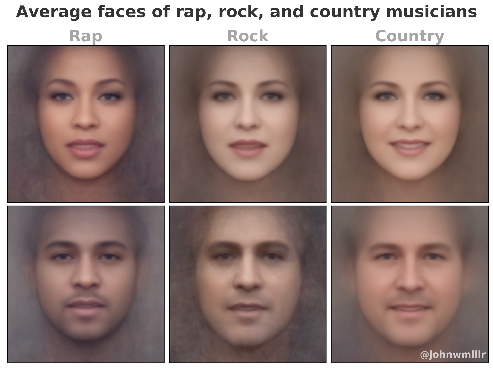

# Facer

Face detection, alignment, and averaging using OpenCV and `dlib`.

Facer draws heavily on [this tutorial](https://www.learnopencv.com/average-face-opencv-c-python-tutorial/) from [Satya Mallick](https://github.com/spmallick). I had to update the code pretty heavily to get the project to work, so I thought I'd share my modifications.

## Example

The image below is an example of Facer's output for one of my posts on [`r/dataisbeautiful`](https://www.reddit.com/r/dataisbeautiful/comments/crxrud/the_average_faces_of_rap_rock_and_country/).

[](https://www.reddit.com/r/dataisbeautiful/comments/crxrud/the_average_faces_of_rap_rock_and_country/)

## Installation

You have my 100% money-back guarantee that the most difficult part of using this package is installing its requirements. Once you've got OpenCV installed, the rest ~~will~~ should be smooth sailing. I've had the best luck with the OpenCV using the `opencv-python` package from PyPI.

Install `facer` using `pip`:

```bash
pip install -U average-facer
```

### Pre-trained detection model

The face landmark detection relies on a pre-trained model that must be downloaded separately from the `dlib` package itself.

```shell
wget http://dlib.net/files/shape_predictor_68_face_landmarks.dat.bz2
```

Unzip the compressed file after it finishes downloading and move it into the `./Facer/model` directory.

## Usage

```python
from facer import facer
import matplotlib.pyplot as plt


# Load face images
path_to_images = "./face_images"  # Put your images here
images = facer.load_images(path_to_images)

# Detect landmarks for each face
landmarks, faces = facer.detect_face_landmarks(images)

# Use the detected landmarks to create an average face
average_face = facer.create_average_face(faces, landmarks, save_image=True)

# View the composite image
plt.imshow(average_face)
plt.show()
```

Facer also supports creating animated GIFs of the averaging process:

```python
from facer import facer

path_to_images = "./face_images"
gif, average_face = facer.create_animated_gif(path_to_images)
```
